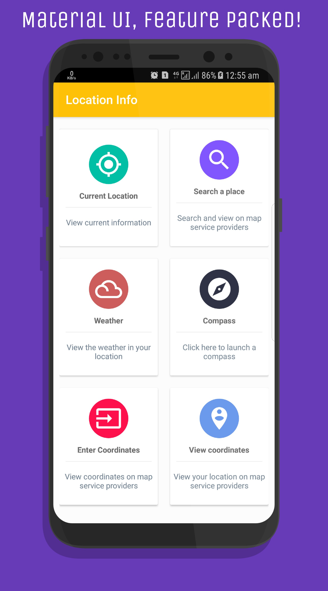
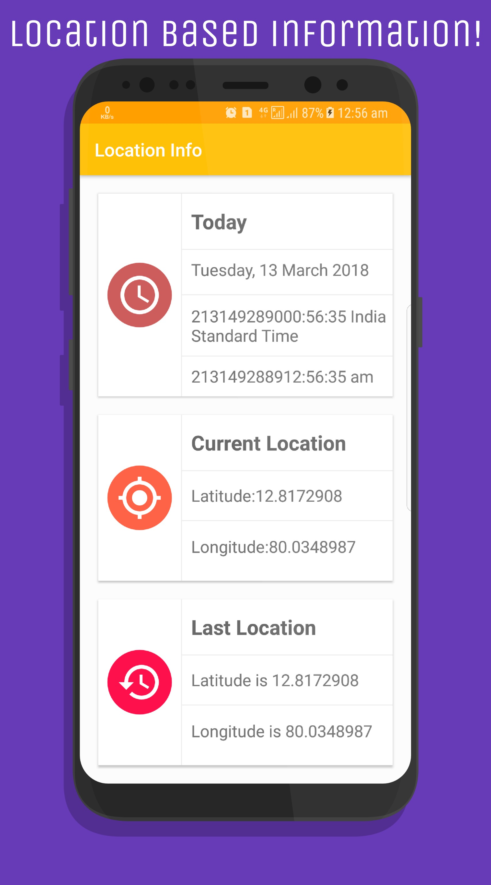

# Location Information. 
This is an android project using the new **FusedLocationProviderClient** as the **FusedLocationApi** has been depreciated and using **GClient** is no longer useful and also includes other features like Weather updates using **JSON parsing**, Compass and so on.  
This project includes the following topics:

- Material UI and design with faint animations.
- Fetch Latitude,Longitude and so on using `FusedLocationProviderClient` API.  
- Material design compass and Weather UI. 
- JSON Object creation.
- Parsing Latitude and Longitude into `URI` classes and `Geo` codes.

## Material Design.
Every design structure and UI implemented here is according to the guidelines of [Google Design](https://design.google/) precisely [Material Design](https://material.io/).
Includes smooth transitions and other minor UI tweaks with a rich dashboard UI. 

## FusedLocationProviderClient API.
This is used mainly because in the new `Google Play Services` update the class `FusedLocationProvider` API will be depreciated and developers will be recommended to use `FusedLocationProviderClient`.
Learn and Implement the new API using this project or head over to the documentation of [FusedLocationProvierClient](https://developers.google.com/android/reference/com/google/android/gms/location/FusedLocationProviderClient).

## Weather updates.
Using `JSON` objects and `AsyncTasks` this is done, the API used is the global `Weather Location API` which results in the slight inaccuracy in Time and also the Place it returns. 
You can use much more accurate API keys to make this better. 

## Enter coordinates & Search places.
You can also enter custom coordinates and search it on `map-service` providers, like `Google Maps`, `Uber` and so on. 
Also includes searching a place and also viewing them on `map-serivce` providers. This involves the implementation of `URI` classes and passing the `geo` code for either query or others.
For more information visit the official documentation of [Google Maps Intents](https://developers.google.com/maps/documentation/urls/android-intents).

## License
BSD 2-Clause LicenseCopyright (c) 2018, Gurubalan.H
All rights reserved.Redistribution and use in source and binary forms, with or withoutmodification, are permitted provided that the following conditions are met:
**Redistributions of source code must retain the above copyright notice, this.**
List of conditions and the following disclaimer:
Redistributions in binary form must reproduce the above copyright notice,this list of conditions and the following disclaimer in the documentation and/or other materials provided with the distribution.This software is provided by the copyright holders and contributors `AS IS`. 
Any express or implied warranties, including, but not limited to, the implied warranties of merchantability and fitness for a particular purpose are disclaimed.  In no event shall the copyright holder or contributers be liable for any direct, indirect, incidental, special, exemplary or consequential damages (Including, but not limited to, procurement of substitutive goods or services; Loss of use, data,
or profits). 
However caused and on any theory of liability, whether in contract, strict liability or tort arising in any way out of the use. 

## Screenshots.
   

### Google Play Store link:
This has been Lisenced and hence will be issued for copyrights, and is only for documentational and educational purposes. 
> [Location Info](https://play.google.com/store/apps/details?id=a1.latitudeandlongitude)

_Thank you for stopping by._

