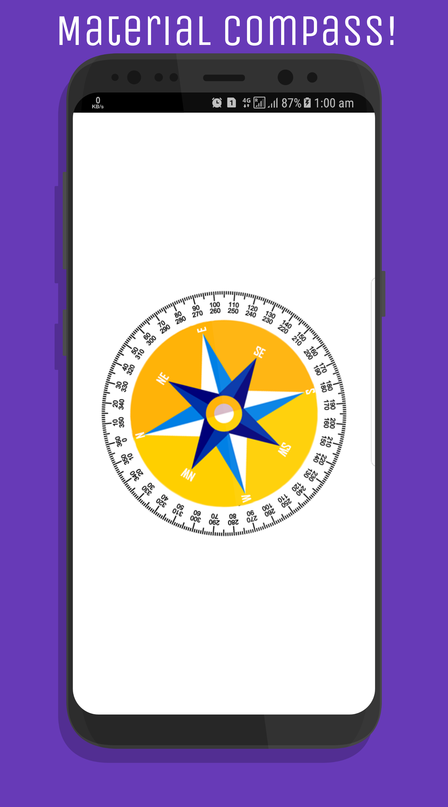
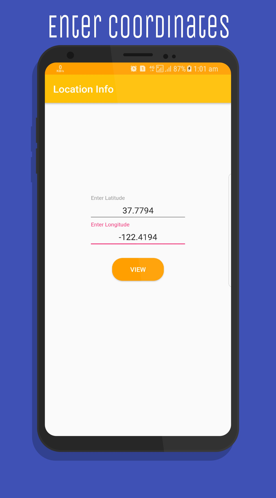
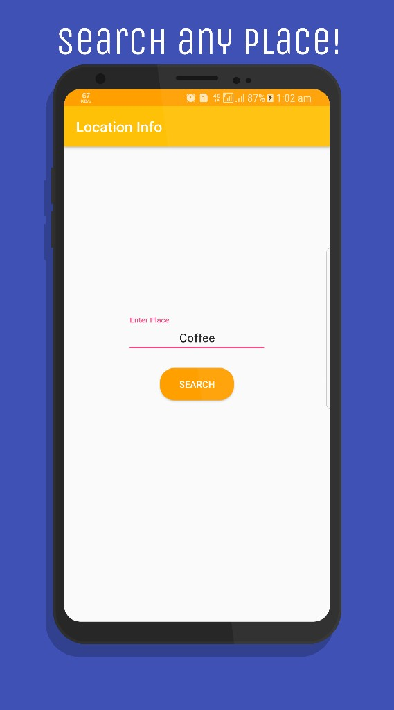

# Location Information. 
This is an android project using the new **FusedLocationProviderClient** as the **FusedLocationApi** has been depreciated and using **GClient** is no longer useful and also includes other features like Weather updates using **JSON parsing**, Compass and so on.  
This project includes the following topics:

- Material UI and design with faint animations.
- Fetch Latitude,Longitude and so on using `FusedLocationProviderClient` API.  
- Material design compass and Weather UI. 
- JSON Object creation.
- Parsing Latitude and Longitude into `URI` classes and `Geo` codes.

## Material Design.
Every design structure and UI implemented here is according to the guidelines of [Google Design](https://design.google/) precisely [Material Design](https://material.io/).
Includes smooth transitions and other minor UI tweaks with a rich dashboard UI. 

## FusedLocationProviderClient API.
This is used mainly because in the new `Google Play Services` update the class `FusedLocationProvider` API will be depreciated and developers will be recommended to use `FusedLocationProviderClient`.
Learn and Implement the new API using this project or head over to the documentation of [FusedLocationProvierClient](https://developers.google.com/android/reference/com/google/android/gms/location/FusedLocationProviderClient).

## Weather updates.
Using `JSON` objects and `AsyncTasks` this is done, the API used is the global `Weather Location API` which results in the slight inaccuracy in Time and also the Place it returns. 
You can use much more accurate API keys to make this better. 

## Enter coordinates & Search places.
You can also enter custom coordinates and search it on `map-service` providers, like `Google Maps`, `Uber` and so on. 
Also includes searching a place and also viewing them on `map-serivce` providers. This involves the implementation of `URI` classes and passing the `geo` code for either query or others.
For more information visit the official documentation of [Google Maps Intents](https://developers.google.com/maps/documentation/urls/android-intents).

## License
MIT License. [View here](LICENSE).
## Screenshots.
     

### Google Play Store link:
This has been Lisenced and hence will be issued for copyrights, and is only for documentational and educational purposes. 
> [Location Info](https://play.google.com/store/apps/details?id=a1.latitudeandlongitude)

_Thank you for stopping by._
